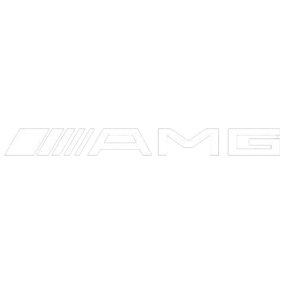
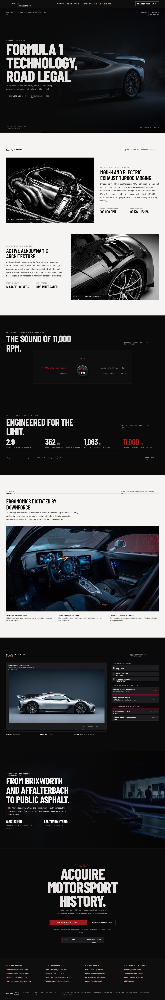

<div align="center">



# AMG ONE — E‑PERFORMANCE
### Formula 1 Technology, Road Legal.

A cinematic, motorsport‑grade landing page for the **Mercedes‑AMG ONE** — built to feel like carbon fiber, titanium, and 11,000 RPM rendered in a browser.

**[🔴 View Live Site →](https://amg-one-mercedes.vercel.app/)**

</div>

<br/>

<div align="center">
  
</div>

<br/>

---

## Overview

**AMG ONE** is a single‑page, editorial‑style showcase site for the Mercedes‑AMG ONE hypercar — the road‑legal transfer of Formula 1 hybrid powertrain technology. The site is built entirely with hand‑crafted **HTML** and **SCSS**, with zero UI frameworks, translating the car's engineering philosophy — precision, restraint, aggression — directly into interface design.

No rounded corners. No soft shadows. No decorative gradients. Every pixel is placed the way a chassis engineer places a component: because it has to be there.

## Design Language — *"Obsidian Velocity"*

The interface runs on a custom design system built specifically for this project, expressing high‑performance engineering through disciplined luxury and motorsport precision.

| | |
|---|---|
| 🖤 **Zero‑radius geometry** | Every container, button, and input is a hard right angle — chamfered only where a real machined part would be. |
| 🔺 **Motorsport Red, used sparingly** | `#9B1B1E` is reserved for critical states and peak‑performance metrics — never more than 5% of the viewport. |
| 📐 **Asymmetric 12‑column grid** | 8/4 and 7/5 splits mirror wind‑tunnel aerodynamic profiles instead of centered, symmetrical layouts. |
| 🔠 **Three‑voice typography** | *Barlow Condensed* for velocity and scale, *Hanken Grotesk* for calm editorial copy, *JetBrains Mono* for telemetry and technical data. |
| 📏 **Hairline structure** | Depth is built from 1px structural borders and plane separation — never blurred elevation shadows. |

<details>
<summary><strong>Full color & typography reference</strong></summary>
<br/>

**Core Palette**

| Token | Hex | Role |
|---|---|---|
| Obsidian Dark Canvas | `#0A0A0A` | Base environment |
| Chassis Surface | `#1C1C1E` | Spec cards, control panels |
| AMG Deep Motorsport Red | `#9B1B1E` | Primary CTAs, critical states |
| Liquid Metallic Silver | `#C7C9CC` | Structural hairlines, borders |
| Muted Mechanical Gray | `#8A8A8E` | Secondary metadata |
| Warm Ivory | `#F5F4F2` | Inverted / high-contrast breaks |

**Typography**

| Family | Use |
|---|---|
| Barlow Condensed | Display headlines, hero type |
| Hanken Grotesk | Body copy, editorial text |
| JetBrains Mono | Telemetry readouts, eyebrows, technical labels |

Full spec lives in [`assets/DESIGN.md`](assets/DESIGN.md).

</details>

## Experience Map

The page is structured as a single continuous descent through the vehicle's engineering story:

```
01  HERO            — Formula 1 Technology, Road Legal
02  POWERTRAIN       — MGU‑H × MGU‑K × 1.6L Turbo V6 hybrid unit
03  ACOUSTIC         — The sound of 11,000 RPM
04  BENCHMARK        — 2.9s 0–100 · 352 km/h · 1,063 PS · 11,000 RPM
05  INTERIOR         — Ergonomics dictated by downforce
06  CONFIGURATION    — Interactive livery & wheel configurator
07  HERITAGE         — From Brixworth and Affalterbach to public asphalt
08  ALLOCATION       — Acquire motorsport history
```

## Tech Stack

- **HTML5** — semantic, single‑page structure
- **SCSS / CSS** — custom design system, compiled to `styles/style.css`
- **Vanilla JS** — interactions (configurator, acoustic module, scroll behavior)
- **Vercel** — deployment & hosting
- **Google Fonts** — Barlow Condensed · Hanken Grotesk · JetBrains Mono

No frameworks. No component libraries. Every interaction is built by hand.

## Project Structure

```
AMG-ONE-LP/
├── index.html
├── styles/
│   ├── style.scss
│   └── style.css
├── assets/
│   ├── DESIGN.md              # Full design system spec
│   ├── car-pics/              # Vehicle photography
│   ├── configuration-pics/    # Livery × wheel combinations
│   ├── icons/                 # AMG / Mercedes marks
│   └── sounds/                # Powertrain acoustic samples
└── design/
    └── desktop-screen.png     # Full-page design preview
```

## Running Locally

```bash
# clone the repository
git clone https://github.com/OmarFarouk-Code/AMG-ONE-LP.git
cd AMG-ONE-LP

# open directly in a browser
open index.html

# — or, if compiling the SCSS source —
sass styles/style.scss styles/style.css --watch
```

## Live Deployment

🔗 **[amg-one-mercedes.vercel.app](https://amg-one-mercedes.vercel.app/)**

---

<div align="center">

*A concept/fan-built showcase project. Mercedes‑AMG, AMG ONE, and all associated marks are trademarks of Mercedes‑Benz Group AG and are used here for editorial and portfolio purposes only.*

**Built by [Omar Farouk](https://github.com/OmarFarouk-Code)**

</div>
